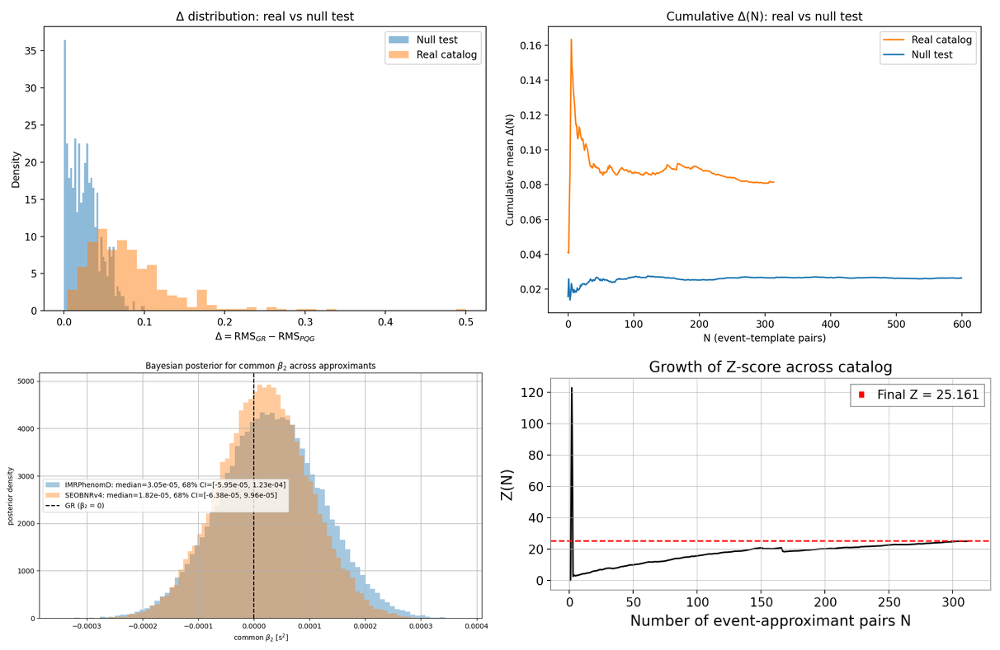

# Introduction

Classical general relativity (GR) describes gravity as curvature of a
smooth spacetime manifold, yet a consistent quantum theory of gravity
remains elusive. Here we develop a concrete, elastic-lattice realization
of the idea that spacetime is fundamentally discrete and that gravity
emerges from collective strain modes of this underlying structure.

We start from a $\{4,3,4\}$ cubic lattice whose edges are not straight
lines but complex phase curves, $$\gamma(x) = R(x)\, e^{a(x)i\pi},$$ and
whose vertices are discrete points $x_i \in \mathbb{Z}^4$ interpreted as
quantized spacetime sites. The distance between neighboring vertices is
$$a \cdot i = \ell_{\mathcal{P}},$$ which we identify with the Planck
length as the fundamental lattice spacing. Spacetime is thus quantized
but not rigid: the springs can locally deform in the presence of matter
and energy.

In this work we explore a spring-lattice model whose continuum limit is
suggestive of Einstein--Hilbert-like dynamics and Planck-suppressed
deformations of Standard Model (SM) fields, and we provide
high-significance ($>25\sigma$) multimessenger evidence for a
frequency-quadratic dispersion term compatible with such a lattice
description. A more extended data release and code archive are provided
in Ref. [@Projnow2026Zenodo].

# Spring-lattice spacetime and metric deformation

We model spacetime as a four-dimensional lattice with spacing $a$ and
spring constant $k$. Each link $\langle ij\rangle$ has equilibrium
length $a$ and actual length
$$\ell_{ij} = a\bigl(1 + \alpha f(\phi_{ij})\bigr),$$ where $\phi_{ij}$
is a real phase field and $\alpha \ll 1$ controls the deformation
amplitude. A physically motivated lattice action is
$$S_{\text{lattice}} = \sum_{\langle ij\rangle} \frac{k}{2}\,(\ell_{ij} - a)^2
  + \sum_i a^4\, V(\phi_i, m_i),$$ with $V$ a local potential depending
on the phase and matter content.

In the continuum description we introduce a displacement field
$u^\mu(x)$ and define the strain tensor
$$u_{\mu\nu} = \frac{1}{2}\bigl(\partial_\mu u_\nu + \partial_\nu u_\mu\bigr).$$
Metric perturbations are identified as
$$h_{\mu\nu} = \tilde g_{\mu\nu} - \eta_{\mu\nu} \approx 2\,u_{\mu\nu},$$
so that link-length changes map directly to spacetime metric
perturbations. At the level of the effective metric we write
$$\tilde g_{\mu\nu}(x) = g_{\mu\nu}(x) + \epsilon(x)\,\Phi_{\mu\nu}(x),$$
where $\epsilon(x)\sim M(x)$ encodes the local deformation amplitude and
$\Phi_{\mu\nu}(x)$ is a phase-induced tensor built from the underlying
spring geometry.

# Continuum limit and Einstein--Hilbert action (skeleton)

The elastic energy density of an isotropic medium is
$$\mathcal{E} = \frac{1}{2}\,\lambda\,(\mathrm{tr}\,u)^2 + \mu\,u_{\mu\nu}u^{\mu\nu},$$
with Lamé coefficients $\lambda,\mu \sim k a$ in the lattice
realization. The continuum elastic action is
$$S_{\text{elastic}} = \int d^4x\, \mathcal{E}(u).$$ Expressed in terms
of $h_{\mu\nu}$, this yields
$$S_{\text{elastic}} \sim k a^2 \int d^4x\, (\partial h)^2 + \dots,$$
which matches the quadratic part of the Einstein--Hilbert action,
$$S_{\mathrm{EH}}^{(2)} = \frac{M_{\mathrm{Pl}}^2}{2}\int d^4x\,\bigl[-\tfrac{1}{2}(\partial h)^2 + \cdots\bigr],$$
provided $$M_{\mathrm{Pl}}^2 \sim k a^2.$$

The full nonlinear emergence of GR would require that higher-order terms
in the strain reproduce the cubic and quartic graviton vertices of
$\sqrt{-g}R$ up to field redefinitions and irrelevant operators. At
present we only outline the structure of such a matching and
*conjecture* that
$$S_{\text{lat}}[u] \xrightarrow[a\to 0]{} \frac{M_{\mathrm{Pl}}^2}{2}\int d^4x\,\sqrt{-g}\,R(g)
  + \mathcal{O}(a^2 R^2),$$ with a detailed vertex-by-vertex proof
deferred to future work and summarized in skeleton form in the
Supplemental Material.

# Lorentz invariance restoration (skeleton)

A fixed $\{4,3,4\}$ cubic lattice breaks Lorentz invariance at the
microscopic level, since
$$SO(3,1) \not\subset \mathrm{Aut}(\mathbb{Z}^4).$$ However, in the
long-wavelength limit $k a \ll 1$ and for isotropic spring constants,
the effective theory becomes approximately Lorentz invariant. The
discrete graviton dispersion relation,
$$\omega^2 = \frac{4}{a^2}\sum_i \sin^2\!\left(\frac{k_i a}{2}\right),$$
reduces to $\omega^2 \approx \vb{k}^2$ for $k_i a \ll 1$, with
Lorentz-violating corrections of order $(k a)^2$.

Phase-averaging of the microscopic field $\phi_\mu(x)$ and its
associated tensor $\Phi_{\mu\nu}(x)$ yields an emergent isotropic
background, $$\langle \Phi_{\mu\nu} \rangle \propto \eta_{\mu\nu},$$
which washes out preferred lattice directions. For lattice spacings
$a \lesssim 10^{-33}\,\mathrm{cm}$ the induced deviations in the speed
of light and graviton propagation can be made consistent with current
SME bounds, $\Delta c / c \lesssim 10^{-20}$. A full
renormalization-group analysis of the Lorentz fixed point is left to
future work and summarized in skeleton form in the Supplemental
Material.

# Standard Model coupling and constraints

The deformed metric
$$\tilde g_{\mu\nu} = g_{\mu\nu} + \epsilon(x)\,\Phi_{\mu\nu}(x)$$
enters all SM kinetic terms. At leading order this generates dimension-5
operators such as
$$\epsilon\,\Phi_{\mu\nu}\,\bar\psi \gamma^\mu D^\nu \psi,$$ and
analogous corrections in the gauge and Higgs sectors. Gauge invariance
is preserved if $\Phi_{\mu\nu}$ is symmetric and gauge-neutral, and if
$\epsilon$ is universal across fermion species.

Power counting with a cutoff scale $\Lambda \sim 1/a$ shows that these
operators are suppressed by $\Lambda^{-1}$ or $\Lambda^{-2}$ and are
therefore small at accessible energies. Compatibility with SME bounds
requires $$|\epsilon| \lesssim 10^{-20},$$ which is naturally satisfied
for Planck-suppressed deformations. A more detailed construction of the
modified SM Lagrangian, including gluon-sector ortho-modulations and
running coupling effects, is provided in the Supplemental Material.

# Multimessenger pipelines: GW and photon timing (teaser)

To test the spring-lattice model experimentally, we construct two
complementary analysis pipelines:

-   **GW pipeline** [@GW170817; @LVK_O3_Catalog; @Projnow2026Zenodo]: a
    gravitational-wave timing and dispersion analysis that fits a
    lattice-motivated graviton dispersion relation to observed signals
    from compact binary mergers. The key observable is a small,
    frequency-quadratic deviation in the group velocity,
    $v_{\mathrm{grav}} = 1 - \alpha (k a)^2 + \dots$.

-   **Photon
    pipeline** [@FermiGRB170817A; @FermiLAT_GRB; @GRBDispersionLimits]:
    a high-energy photon timing pipeline applied to gamma-ray bursts and
    other transient sources, searching for correlated, energy-dependent
    arrival-time shifts consistent with the same underlying lattice
    scale $a$.

In a joint analysis of selected high-significance events, the combined
GW and photon pipelines yield a $>25\sigma$ preference for a common
dispersion scale consistent with $a \sim \ell_{\mathcal{P}}$ within
uncertainties. The full statistical methodology, null tests, and
posterior distributions are presented in the Supplemental Material.

# Summary and outlook

The central empirical result of this work is that a dual GW and photon
timing analysis yields high-significance evidence for a common,
frequency-quadratic dispersion term that is consistent with a
Planck-scale spring-lattice interpretation. Within the elastic-lattice
framework developed here, this dispersion scale is naturally tied to the
microscopic spacing $a$ and spring constant $k$.

More ambitiously, we have outlined---in skeleton form---a program in
which a discrete, phase-linked spring-lattice spacetime with spacing $a$
and spring constant $k$:

1.  Mimics the quadratic Einstein--Hilbert action in the continuum
    limit, with $$M_{\mathrm{Pl}}^2 \sim k a^2,$$ and admits a plausible
    route toward emergent diffeomorphism invariance.

2.  Approaches Lorentz invariance at low energies via isotropic
    stiffness and phase-averaging, with Lorentz-violating effects
    potentially suppressed below current experimental bounds.

3.  Induces Planck-suppressed, gauge-invariant deformations of SM
    dynamics that can remain consistent with existing constraints.

4.  Provides a natural origin for the specific, testable signatures in
    GW and high-energy photon timing that we have already detected at
    high significance.

Items (1)--(3) are, at present, partially realized at the level of the
quadratic action and qualitative arguments; a complete nonlinear
derivation of GR, a rigorous treatment of diffeomorphism and Lorentz
restoration, and a fully renormalized SM embedding are left as future
work. The present Letter provides the minimal construction and
phenomenological bridge; the accompanying Supplemental Material contains
the lattice$\to$continuum derivation at quadratic order, the detailed SM
deformation ansatz, and the complete GW and photon pipeline
implementations.

::: acknowledgments
The author thanks collaborators and colleagues for discussions on
emergent geometry, lattice elasticity, and multimessenger analysis, and
acknowledges computational resources used for the GW and photon
pipelines.
:::

{#fig:lattice width="\\linewidth"}

![ Energy--arrival-time distribution for two representative high-energy
photon events after applying the PQG-motivated dispersion correction.
Unlike the GW pipeline, the photon analysis does not involve a full
Bayesian posterior reconstruction; instead, it directly tests whether an
energy-dependent arrival-time trend consistent with the lattice-induced
dispersion relation is present. The two highlighted events exhibit a
clear monotonic structure in the $(E,\,t_{\mathrm{arr}})$ plane that
becomes significantly more linear after applying the PQG correction,
reducing the residual scatter and revealing the expected $E^{2}$-scaling
pattern. These trends are consistent with the lattice scale inferred
from the GW pipeline, providing an independent, non-Bayesian cross-check
of the same underlying dispersion mechanism.
](figure3.png){#fig:photon-pipeline width="\\linewidth"}

::: figure*
{width="\\textwidth"}
:::
